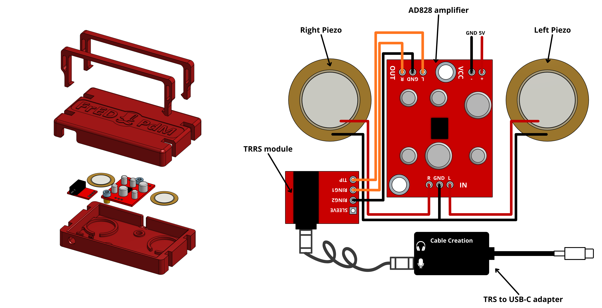
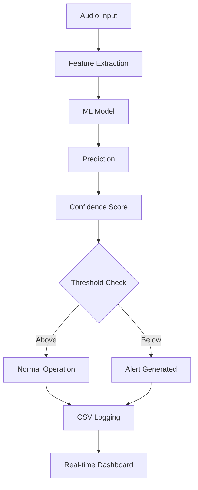

# FrED Predictive Maintenance System

[](https://opensource.org/licenses/MIT)
[](https://www.python.org/downloads/)

## � Requirements

Before the workshop session, ensure you have:

- **🐍 Anaconda Distribution** - Download from [anaconda.com](https://www.anaconda.com/products/distribution)
- **📓 Jupyter Notebook** - Included with Anaconda installation
- **🎤 Audio Input Device** - Contact microphone provided by instructors
- **�️ Compatible Operating System** - Windows, macOS, or Linux

---

A comprehensive predictive maintenance system that uses audio analysis and machine learning to detect equipment faults and anomalies in industrial machinery.

## 🎯 Overview

The FrED PAL (Predictive Analysis and Learning) kit is an advanced predictive maintenance platform that leverages:
- **Audio Signal Processing** for real-time machinery health monitoring
- **Machine Learning Models** for fault classification and prediction
- **Interactive Jupyter Notebooks** for data collection and analysis
- **Real-time Monitoring Interface** with continuous updates and alerts

## 🚀 Features

### Core Functionality
- **Real-time Audio Monitoring** - Continuous machinery health assessment
- **Multi-class Fault Detection** - Identifies various equipment conditions (Good, Chipped Tooth, etc.)
- **Confidence-based Alerting** - Configurable thresholds for predictive alerts
- **Data Logging & Export** - Automatic CSV logging with machine identification
- **Interactive UI** - Professional industrial-style monitoring interface

### Advanced Features
- **Enhanced Live Inspector** - Real-time graphs updating every 2 seconds
- **Machine ID Management** - Multi-machine monitoring capabilities
- **Background Processing** - Non-blocking continuous operation
- **Automatic Data Backup** - Configurable auto-save intervals
- **Comprehensive Metrics** - Performance tracking and analytics


## 🛠️ Installation

### Hardware Setup

The FrED PAL kit assembly process is straightforward and requires minimal technical expertise. Begin by carefully assembling all the components according to the hardware schematic provided below. The sensor module should be securely mounted on the gearbox lid or target equipment surface to ensure optimal vibration capture. Once the mechanical assembly is complete, connect the power supply to the FrED PCB, providing the required 5V power and ground connections to all active components.

Next, establish the signal pathway by connecting the TRS cable from the TRRS module to your computer's audio interface through the TRS to USB-C adapter. This connection allows the analog signals captured by the piezoelectric sensors to be transmitted to your computer for real-time processing and analysis. Ensure all connections are secure and properly aligned before powering on the system.

#### Hardware Assembly Diagram



The diagram above illustrates the complete hardware configuration including the piezoelectric sensors, AD828 amplifier module, TRRS interface board, and USB-C connectivity. Refer to this schematic during assembly to ensure correct component placement and connections.

### Jupyter Notebook Setup

**🚀 Getting Started:**
1. **Launch Anaconda Navigator** or use command line
2. **Start Jupyter Notebook** from Anaconda Navigator or run `jupyter notebook`
3. **Navigate to the repository folder** in Jupyter's file browser
4. **Open the data recorder notebook:** `Data_Recording.ipynb`

**📝 Workshop Notebooks:**
- **`Data_Recording.ipynb`** - Record and collect machinery audio samples locally
- **`Data_Analytics_Workshop.ipynb`** - Complete signals processing and machine learning pipeline for model training.
- **`Model_Deployment.ipynb`** - Use the best-performing model for a live model deployment prediction.


## 🔍 Key Components

### Audio Processing
- **Multi-format Support** - WAV, MP3, and other audio formats
- **Real-time Processing** - Low-latency audio analysis
- **Feature Engineering** - Advanced signal processing techniques
- **Noise Reduction** - Filtering and preprocessing capabilities

### Machine Learning
- **Classification Models** - Support for various ML algorithms
- **Confidence Scoring** - Probability-based predictions
- **Model Persistence** - Save and load trained models
- **Batch Processing** - Handle multiple audio files efficiently

### User Interface
- **Jupyter Integration** - Interactive notebook environment
- **Real-time Visualization** - Live updating charts and graphs  
- **Professional Design** - Industrial-style monitoring interface
- **Export Capabilities** - CSV data export with metadata

## 📊 Data Flow




## 📝 Documentation

- **[Features Documentation](FEATURES_DOCUMENTATION.md)** - Detailed feature specifications
- **Notebook Examples** - Interactive tutorials and examples
- **API Reference** - Function and class documentation
- **Best Practices** - Guidelines for optimal usage

### FrED PAL Kit - Bill of Materials (BOM)

The FrED PAL (Predictive Analysis and Learning) kit is an affordable, open-source hardware solution designed to bring advanced predictive maintenance capabilities to educational institutions and small-scale operations. The kit combines essential components for real-time machinery health monitoring through audio signal analysis. Each component has been carefully selected to balance cost-effectiveness with reliability and performance. The total kit cost is approximately **$25.48**, making it an accessible solution for implementing predictive maintenance systems without significant capital investment.

#### Hardware Components Breakdown

| Element | Description | Quantity | Cost x Unit (USD) | Total (USD) |
|---------|-------------|----------|------------------|------------|
| 1 | 0.787 in piezoelectric sensor | 1 | $0.53 | $1.07 |
| 2 | AD828 board module | 1 | $2.50 | $2.50 |
| 3 | TRRS board module | 1 | $2.56 | $2.56 |
| 4 | Jumpers | 1 | $0.08 | $0.23 |
| 5 | 57.26 grs of Sparkle PLA | 57.26 | $0.02 | $1.43 |
| 6 | M3-4mm heat insert | 2 | $0.10 | $0.20 |
| 7 | TRS to USB-C adapter | 1 | $14.99 | $14.99 |
| 8 | TRS cable | 1 | $2.50 | $2.50 |
| | | | **Total:** | **$25.48** |

#### Component Details

- **Piezoelectric Sensor**: Captures vibration and acoustic signals from machinery, converting mechanical motion into electrical signals for analysis
- **AD828 Board Module**: High-speed operational amplifier module for signal conditioning and amplification
- **TRRS Board Module**: Handles audio signal routing and interface compatibility
- **Jumpers**: Electrical connectors for flexible circuit configuration
- **Sparkle PLA Filament**: 3D-printed enclosure material for professional assembly
- **M3-4mm Heat Inserts**: Hardware fasteners for durable assembly
- **TRS to USB-C Adapter**: Bridges the analog audio interface with modern USB-C digital systems
- **TRS Cable**: Standard audio connection cable for signal transmission

### Repository Folder Structure

- **`data/audio`** - Storage location for all audio files collected during data recording and preprocessing. Contains sample audio data for training and testing the predictive maintenance models.

- **`Preparation`** - Contains import functions and preprocessing utilities for data handling and signal processing. This folder includes modules for loading audio files, feature extraction, and data preparation before model training.

- **`trained_models`** - Storage location for machine learning models. Contains our best-performing trained model used for real-time predictions and deployment in the Model_Deployment.ipynb notebook.

## 🐛 Troubleshooting

### Common Issues

**Microphone Permission Denied (macOS)**
```bash
# Grant microphone access in System Preferences
System Preferences → Security & Privacy → Privacy → Microphone
```

**Module Import Errors**
```bash
# Ensure you're in the project directory
cd FrED-Predictive-Maintenance
pip install -r requirements.txt
```

**Audio Device Not Found**
```python
# List available devices
from Preparation.Import.audio_recorder import list_audio_devices
devices = list_audio_devices()
print('\n'.join(devices))
```

## 📈 Performance

### System Requirements
- **CPU**: Multi-core processor recommended for real-time processing
- **RAM**: 4GB minimum, 8GB recommended
- **Storage**: 1GB for base installation, additional space for audio data
- **Audio**: Compatible microphone or audio input device

### Optimization Tips
- Use appropriate buffer sizes for your system
- Configure auto-save intervals based on storage capacity
- Monitor CPU usage during continuous operation
- Adjust confidence thresholds based on model performance

## 📄 License

This project is licensed under the MIT License - see the [LICENSE](LICENSE) file for details.
